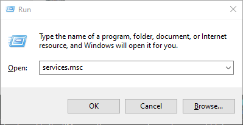
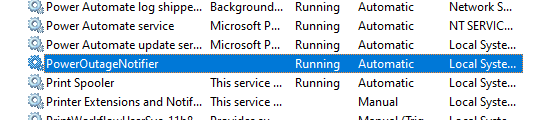

# PowerOutageNotifier

A Windows service, written in .NET Framework 4.8 to send Telegram notifications when:
1. a planned power outage is scheduled in Belgrade, Serbia
2. a planned water outage is scheduled in Belgrade, Serbia
3. an unplanned water outage occurs in Belgrade, Serbia
4. a parking fine is received in Belgrade, Serbia

## Quick Setup and Install

1. Follow [these](https://www.directual.com/lesson-library/how-to-create-a-telegram-bot) instructions to create your own bot
1. Send "/token" to BotFather to obtain the token for your bot and replace the token in the `bot-token.example.txt` file
1. Rename the `bot-token.example.txt` file to `bot-token.txt`
1. Send "/my_id" to https://t.me/get_id_bot  
Note down your Chat ID which the bot will tell you  
**Example:** Your Chat ID = 123456
1. In `userdata.example.csv`, replace **"123456"** with your Chat ID
1. Replace the **"Палилула"** and **"САВЕ МРКАЉА"** with your own District Name and Street Name
1. Rename `userdata.example.csv` to `userdata.csv`
1. Build the project in Visual Studio
1. From an admin console run ``install.bat``  
Note: `install.bat` uses [installutil](https://learn.microsoft.com/en-us/dotnet/framework/tools/installutil-exe-installer-tool), which needs to be installed beforehand. This tool is automatically installed with Visual Studio.
1. Press Win+R and type "services.msc" then press "OK"  

1. Double-check in Services that the PowerOutageNotifier is running and that the startup is set to "automatic"  

1. Double-check that the Bot you created sent you a message "Service running on <computer_name>"  
